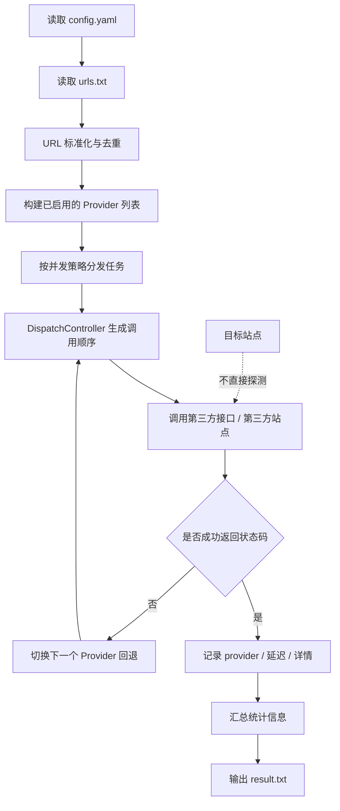

# CheckUrl

一个面向批量场景的异步 URL 状态检测工具。它的核心亮点是只调用第三方站点或第三方接口完成检测，不直接对目标站点发起常规探测请求；程序会从输入文件读取网址，按配置并发执行检测，并在多个 Provider 之间自动回退，输出每个 URL 的最终状态结果。

## 已接入第三方接口 / 站点

这是项目最直观的亮点：**不直接探测目标站点，而是复用现成第三方检测能力**。

| Provider | 已接入接口 / 站点 |
| --- | --- |
| apihz | `cn.apihz.cn` |
| xiarou | `v.api.aa1.cn` |
| haikou_luxia | `api.lxurl.net` |
| xianglian | `openapi.chinaz.net` |
| ip33 | `api.ip33.com` |
| la46 | `www.46.la` |
| nullgo | `www.nullgo.com` |
| fulimama | `www.fulimama.com` |
| chinaz_tool | `tool.chinaz.com` |
| cjzzc | `www.cjzzc.com` / `tt*.cjzzc.com` / `tt*.yywy.cn` |
| boce | `www.boce.com` |
| smallseotools | `smallseotools.com` |

一眼看点：`apihz`、`aa1`、`lxurl`、`Chinaz`、`IP33`、`46.la`、`NullGo`、`FuliMama`、`Cjzzc`、`Boce`、`SmallSEOTools` 都已接入到回退链里。

## 原理流程图



原理上，它不是自己去直连目标站点做常规状态探测，而是把待检测 URL 交给多个第三方 Provider 处理，再把各 Provider 返回的状态码、延迟和详情统一收敛输出。

## 特点

- 第三方接口驱动：这是项目最核心的特点，检测过程只调用第三方站点或接口能力，不直接探测目标 URL。
- 异步批量检测：基于 `asyncio` 和 `aiohttp`，适合一次处理大量 URL。
- 多 Provider 回退：单个 Provider 失败后会自动切换到下一个 Provider。
- 灵活调度：支持 `priority`、`round_robin`、`url_hash`、`adaptive` 多种调度策略。
- 限流与冷却：支持全局限流、单 Provider 限流、限流后冷却与指数退避。
- 可观测性：支持 JSON 行日志、进度输出、Provider 维度统计。
- 易于排查：支持 `--dry-run` 校验输入与配置，也支持 `--test-provider` 单独测试某个 Provider。
- 便于扩展：Provider 实现集中在 `checkurl/providers/`，新增数据源成本较低。

## 目录结构

```text
checkurl/
├── batch_url_status_checker.py   # 启动入口
├── checkurl/
│   ├── __main__.py               # CLI 入口
│   ├── config.py                 # 配置加载与校验
│   ├── dispatcher.py             # Provider 调度与回退
│   ├── output.py                 # 结果输出
│   ├── stats.py                  # 统计汇总
│   └── providers/                # 各 Provider 实现
├── config.yaml                   # 运行配置
├── urls.txt                      # 输入 URL 列表
└── tests/                        # 单元测试
```

## 环境要求

- Python 3.10+

## 安装依赖

当前仓库未提供依赖清单文件，可先手动安装代码中实际使用到的核心依赖：

```bash
python3 -m pip install aiohttp PyYAML yarl
```

## 配置说明

默认配置文件为 `config.yaml`，主要包含三部分：

- `input`：输入文件路径
- `output`：输出文件路径
- `runtime`：并发、超时、重试、限流、调度策略等运行参数
- `providers`：各 Provider 的启用状态、优先级、RPS 及附加参数

说明：

- 某些 Provider 依赖密钥或 API 参数；如果未填写，程序会自动跳过对应 Provider。
- `smallseotools` 即使启用，也会被放到回退链末尾作为兜底数据源。

## 使用方式

### 1. 校验配置与输入

```bash
python3 -m checkurl --dry-run -c config.yaml
```

### 2. 单独测试某个 Provider

```bash
python3 -m checkurl --test-provider xiarou --url https://www.example.com -c config.yaml
```

### 3. 批量执行检测

```bash
python3 -m checkurl -c config.yaml
```

或使用包装入口：

```bash
python3 batch_url_status_checker.py -c config.yaml
```

## 输入格式

`urls.txt` 中每行一个 URL，例如：

```text
https://www.google.com
https://www.github.com
https://www.wikipedia.org
```

程序会对输入做标准化与去重后再执行检测。

## 输出格式

默认输出到 `result.txt`，每行 5 列，使用制表符分隔：

```text
状态码    原始URL    provider名    延迟毫秒    详情
```

示例：

```text
200	https://www.google.com	xiarou	123.45	ok
```

补充说明：

- `200` 结果会优先排在输出前面。
- 当所有 Provider 都失败时，会输出失败结果与错误详情。

## 支持的调度能力

`runtime.provider_order_strategy` 支持：

- `priority`：严格按优先级顺序执行
- `round_robin`：轮转起始 Provider
- `url_hash`：按 URL 哈希稳定分配起始 Provider
- `adaptive`：优先使用成功率更高、延迟更低的 Provider

## 测试

运行单元测试：

```bash
python3 -m unittest discover -s tests -v
```

执行基础语法校验：

```bash
python3 -m compileall checkurl tests batch_url_status_checker.py
```

## 注意事项

- 本项目依赖第三方站点或接口，Provider 的页面结构、限流策略、鉴权方式发生变化时，可能需要同步调整解析逻辑。
- 不建议将实际生产密钥直接提交到公开仓库。
